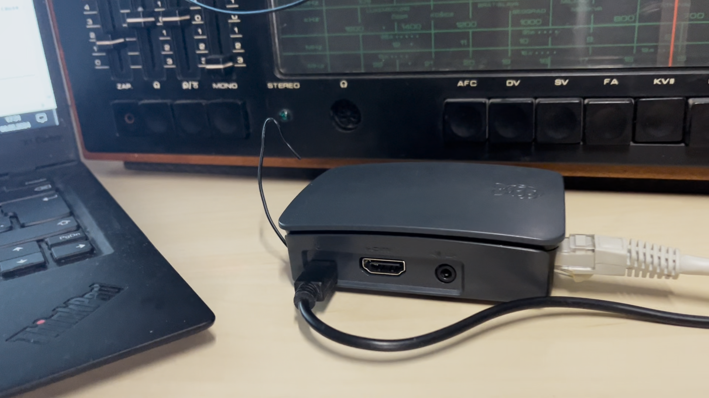
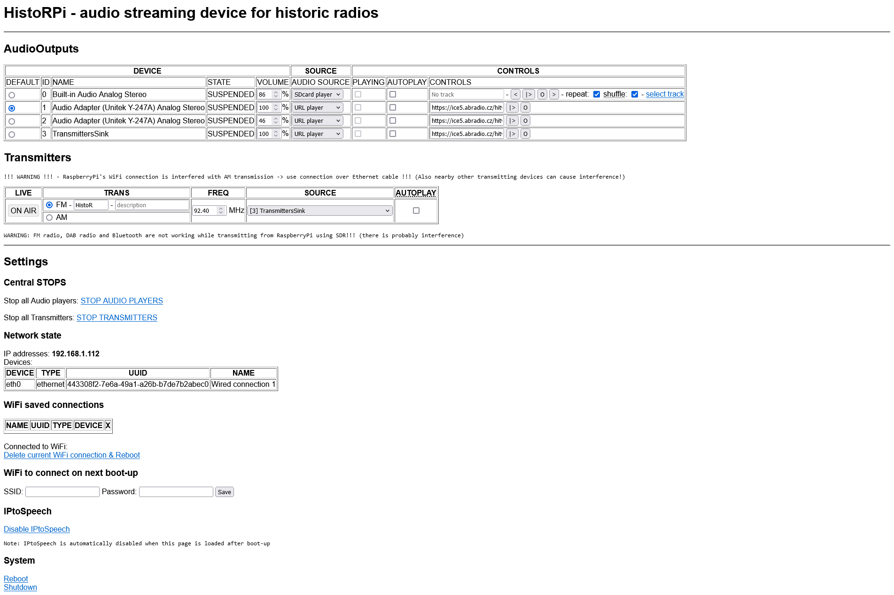
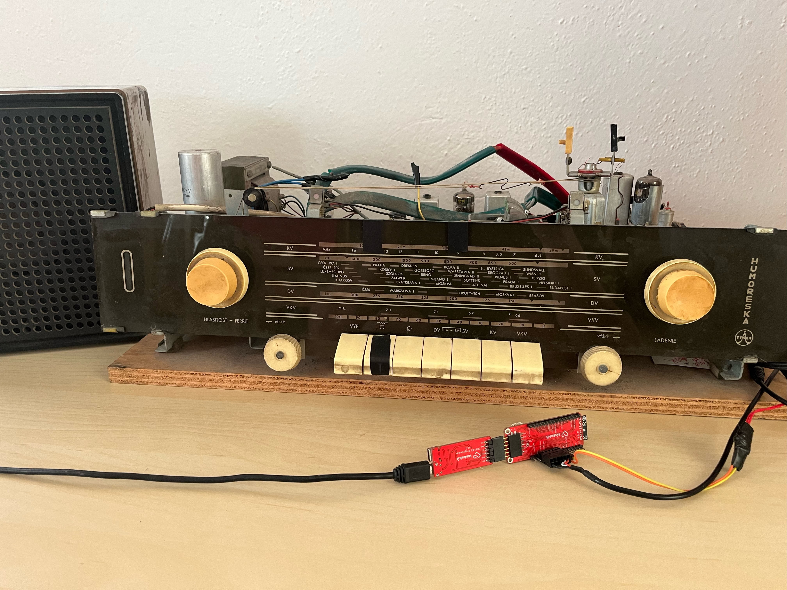
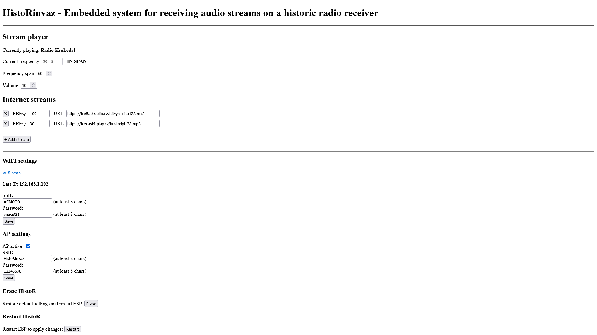

# BP-HistoR
Embedded system for receiving audio streams on a historic radio receiver

## Abstract
The aim of the work is to create an embedded device on Raspberry Pi or ESP32 platform,
which will allow to play audio streams on historical radios according to their functionality,
either by interfering with their electronics, or by simulating FM and AM broadcasts using
SDR or a created transmitter. The result is a device controlled via a web application allowing
audio streams from SD card, internet, Bluetooth or available FM and DAB broadcasts to
be played on historical radios.

## Result
The result is two versions, one based on a Raspberry Pi using a Software Defined Radio to simulate live radio transmission ([HistoRPi](https://github.com/F3lda/HistoRPi)) and the other based on an ESP32 playing audio through the internal amplifier of a historical radio receiver and controlled by a tuning capacitor ([HistoRinvaz](https://github.com/F3lda/HistoRinvaz)).

### HistoRPi
Video: [https://www.youtube.com/watch?v=wEk9IPGQwg4](https://www.youtube.com/watch?v=wEk9IPGQwg4&list=PLyx6PxqS5pZ5c0ZQkjKCWe2286lkeXFXk)

### HistoRinvaz
Video: [https://www.youtube.com/watch?v=tp0sWiJ3ixc](https://www.youtube.com/watch?v=tp0sWiJ3ixc&list=PLyx6PxqS5pZ5c0ZQkjKCWe2286lkeXFXk)

## Installation
Select the desired version in the release directory and read the README.
[HistoRPi](./release/HistoRPi)
[HistoRinvaz](./release/HistoRinvaz)

## Notes
Further information can be found in the docs.
[HistoR PDF](./docs/FIT_BUT_thesis_2024.pdf)
